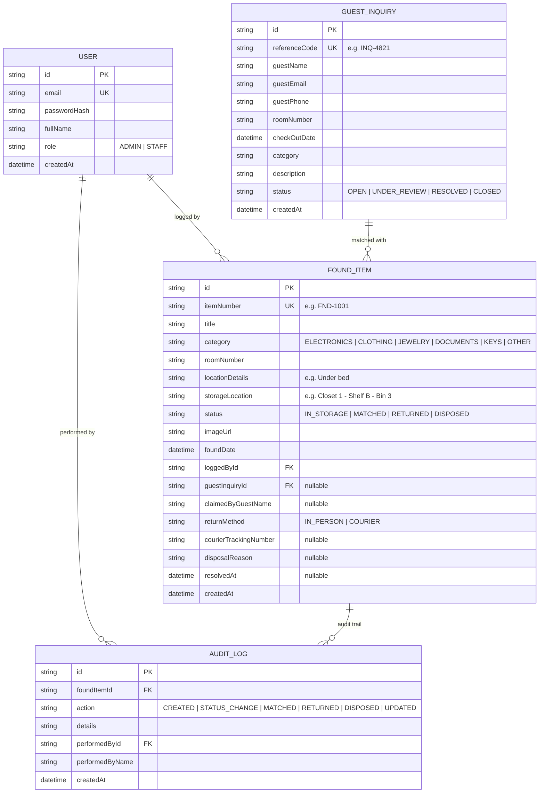

# FoundDesk 🛎️📦
> **Hotel Lost & Found Property Ledger & Smart Guest Matcher**  
> *A Micro-SaaS built for independent boutique hotels, resorts, and B&Bs.*

Developed as part of the **Full Stack Developer Assessment for Cnykra Technologies**.

---

## 1. Problem Statement

### The Operational Reality
Independent boutique hotels, luxury resorts, and B&Bs (20–120 rooms) handle hundreds of departing guests each week. Guests frequently leave behind valuable personal belongings—wireless headphones, jewelry, passports, charging cables, and clothing.

Today, these properties manage lost property through **informal, fragmented systems**:
* Physical spiral notebooks or paper binders stored behind the front desk.
* Disorganized Excel spreadsheets accessible on only one back-office computer.
* Hasty messages buried inside hotel WhatsApp groups.

### Why This Problem Matters
1. **High Friction During Shift Changes:** When an incoming front-desk agent receives a panicked call (*"Did I leave my black headphones in Room 304 on Tuesday?"*), they cannot quickly verify if housekeeping discovered them without placing the guest on hold and physically searching the storage closet.
2. **Disputed Claims & Accidental Handover:** Without recorded verification of identity or handover method, properties risk handing valuable items to the wrong person or facing legal liability.
3. **Storage Congestion & Regulatory Risk:** Hotels often hold items indefinitely because they lack an automated mechanism to identify items that have passed the standard 30- to 60-day retention threshold for charitable donation or disposal.
4. **Guest Dissatisfaction:** Delayed or lost belongings turn an otherwise pleasant 5-star hotel stay into a 1-star public review.

---

## 2. Target User

* **Primary Users:** Front Desk Receptionists and Housekeeping Supervisors managing day-to-day intake, storage bins, and guest handovers.
* **Secondary Users:** Hotel Guests who have departed and need a seamless, self-service channel to report missing personal items.

---

## 3. The Before vs. After Workflow

```
BEFORE (Manual / Chaotic):
Guest calls front desk ──> Front desk puts guest on hold ──> Walks to housekeeping closet ──> Searches paper notebook ──> Miscommunication / lost items.

AFTER (FoundDesk):
Housekeeping finds item ──> Logs into FoundDesk in 30s with Storage Bin # (e.g. Shelf B, Bin 2) ──> Status: IN_STORAGE
                                  │
Guest submits public report ──────┴──> Smart Matchmaker flags 85% match (Room + Category + Date Proximity)
                                  │
Staff confirms match ─────────────┴──> Verified Handover (In-Person ID check or Courier Tracking recorded) ──> Status: RETURNED
```

---

## 4. How the Product Works

### 1. Internal Staff Ledger (Authenticated)
* **Rapid Intake:** Front desk or housekeeping logs found items with title, category, room/area found, specific storage shelf/bin ID, date found, and optional photo.
* **Inventory State Machine:**
  * `IN_STORAGE`: Currently secured in hotel storage.
  * `MATCHED`: Linked to an active guest inquiry awaiting claim.
  * `RETURNED`: Released to guest (requires recipient name and handover method: in-person or courier tracking number).
  * `DISPOSED`: Archival/donation after exceeding property retention threshold (requires authorized disposal reason).
* **Chain of Custody Audit Log:** Every action records an immutable log entry detailing who made the change, the old status, the new status, and timestamp.

### 2. Public Guest Inquiry Portal (No Login Required)
* Clean public submission page at `/report-lost`.
* Guest inputs name, contact details (email/phone), room number stayed in, checkout date, item category, and description.
* Generates a unique **Tracking Reference Code** (e.g., `INQ-7821`) for the guest.

### 3. Smart Matching Engine
* Algorithmic heuristic scoring (0–100%) that cross-references open guest inquiries against storage inventory:
  * **Exact Room Match:** +50 points
  * **Same Item Category:** +30 points
  * **Checkout Date Proximity (±3 days):** +20 points
  * **Keyword Overlap:** Up to +20 points
* Generates confidence ratings (`HIGH`, `MEDIUM`, `LOW`) and visual match reasons.
* 1-click **Link & Match** transitions item and inquiry states simultaneously.

### 4. Storage Compliance & Retention Analytics
* Identifies aging items stored for > 30 days to facilitate regular charitable donations.
* Visual category distribution and guest return rate metrics.

---

## 5. Technology Stack & Rationale

| Layer | Tool | Rationale |
|---|---|---|
| **Framework** | **Next.js 14 (App Router)** | Full-stack architecture; co-locates REST API route handlers with React Server & Client components; eliminates CORS issues; single-command deployment. |
| **Language** | **TypeScript** | Strict compile-time type safety across database models, API payloads, and UI props. |
| **Database & ORM** | **Prisma ORM + SQLite / PostgreSQL** | Prisma provides typesafe database queries and automated schema migrations. SQLite gives zero-setup local development; switching to PostgreSQL in production requires only changing `DATABASE_URL`. |
| **Authentication** | **Custom JWT + Secure HTTP-only Cookies** | Built using `jose` and `bcryptjs`. Transparent, auditable, and easy to explain in an interview compared to opaque third-party OAuth wrappers. |
| **Validation** | **Zod** | Schema-first input validation on both API route handlers and client forms. Protects against malformed data and injection attacks. |
| **Styling** | **Tailwind CSS + Lucide Icons** | Clean, accessible, responsive design tailored for fast data entry by busy hotel staff on desktop and mobile. |
| **Testing** | **Vitest** | Fast unit test execution for validation schemas, state transitions, and matching heuristics. |

---

## 6. Database Schema Design



---

## 7. Scope Discipline (What Was Intentionally Left Out)

To ensure this Micro-SaaS remained **laser-focused, rock-solid, and achievable within a 15–20 hour scope**, the following were intentionally excluded:
1. **Online Payment Processing for Shipping (Stripe):** Instead of adding payment processing overhead, staff record the courier name and tracking code directly upon handover.
2. **AI Computer Vision Matching:** Instead of relying on unreliable image recognition APIs, matching uses deterministic hotel-specific operational metadata (Room Number + Category + Date Range), which is vastly more accurate in property management.
3. **Full Hotel Property Management System (PMS) 2-Way Sync:** Built as a standalone, lightweight operational tool that does not depend on complex Opera/Mews API enterprise contracts.

---

## 8. What I Would Build Next (Roadmap)

1. **Automated Guest Email Notifications:** Integrate Resend/SendGrid to dispatch an automated email when an item is linked (*"We have located an item matching your inquiry"*).
2. **Barcode / QR Code Sticker Generator:** 1-click generation of printable adhesive thermal labels containing the `itemNumber` and a QR code for instantaneous shelf scanning.
3. **Multi-Property Organization Support:** Allow a hospitality management group to toggle between multiple resort properties under one organization account.

---

## 9. Important Architectural Trade-offs

* **SQLite (Dev) vs PostgreSQL (Prod):** 
  * *Trade-off:* Used SQLite locally for instant setup and zero Docker prerequisites. 
  * *Production Path:* Prisma abstracts the SQL dialect; changing `provider = "postgresql"` in `schema.prisma` and supplying a PostgreSQL connection string enables deployment to Neon/Supabase immediately.
* **Custom JWT Cookie Auth vs NextAuth / Auth0:** 
  * *Trade-off:* Implemented custom HMAC-SHA256 JWT sessions in HTTP-only cookies with `jose` and `bcryptjs`. 
  * *Rationale:* Provides complete control over cookie attributes (`SameSite`, `HttpOnly`, `Path`), eliminates third-party redirects, and allows direct explanation of authentication fundamentals in an interview.

---

## 10. Local Setup & Running Instructions

### Prerequisites
* **Node.js** (v18.17.0 or later, v20+ recommended)
* **npm** or **pnpm**

### Step-by-Step

1. **Clone the repository:**
   ```bash
   git clone <repository-url>
   cd ResAi
   ```

2. **Install dependencies:**
   ```bash
   npm install
   ```

3. **Configure Environment Variables:**
   A `.env` file is pre-configured for local development. You can copy from `.env.example`:
   ```bash
   cp .env.example .env
   ```

4. **Initialize Database and Seed Demo Data:**
   ```bash
   npx prisma db push
   node prisma/seed.js
   ```

5. **Run the Automated Test Suite:**
   ```bash
   npm test
   ```
   *Expected: All 16 unit and integration tests passing.*

6. **Start the Development Server:**
   ```bash
   npm run dev
   ```
   Open [http://localhost:3000](http://localhost:3000) in your browser.

---

## 11. Demo Credentials

The seed script provides two pre-configured hotel operational staff accounts:

| Role | Email | Password | Purpose |
|---|---|---|---|
| **General Manager (Admin)** | `admin@grandazure.com` | `HotelStaff@2026` | Full ledger access, disposal authorizations, compliance review |
| **Housekeeping Attendant (Staff)** | `sarah.housekeeping@grandazure.com` | `HotelStaff@2026` | Item intake, shelf binning, status updates |

*The login page also provides 1-click demo credential autofill buttons.*

---

## 12. Public Deployment Guide

FoundDesk is designed for seamless zero-friction public deployment.

### Option A: Vercel + Neon/Supabase (Recommended)

1. **Create a Free PostgreSQL Database:**
   * Go to [Neon.tech](https://neon.tech) or [Supabase.com](https://supabase.com) and create a free project.
   * Copy the PostgreSQL connection string (`postgres://...`).
2. **Push Code to GitHub:**
   ```bash
   git remote add origin <your-github-repo-url>
   git push -u origin master
   ```
3. **Deploy on Vercel:**
   * Import your GitHub repository into [Vercel](https://vercel.com).
   * In **Environment Variables**, set:
     * `DATABASE_URL`: Your PostgreSQL connection string.
     * `JWT_SECRET`: A secure random string (at least 32 characters).
     * `NEXT_PUBLIC_APP_NAME`: `FoundDesk`
     * `NEXT_PUBLIC_HOTEL_NAME`: `Grand Azure Boutique Hotel & Resort`
   * In **Build Command**, specify:
     ```bash
     prisma generate && prisma db push && node prisma/seed.js && next build
     ```
   * Click **Deploy**.

### Option B: Render or Railway (Docker / Node)
1. Set the environment variables in your Render service dashboard.
2. Build command: `npm install && npx prisma db push && node prisma/seed.js && npm run build`
3. Start command: `npm run start`
